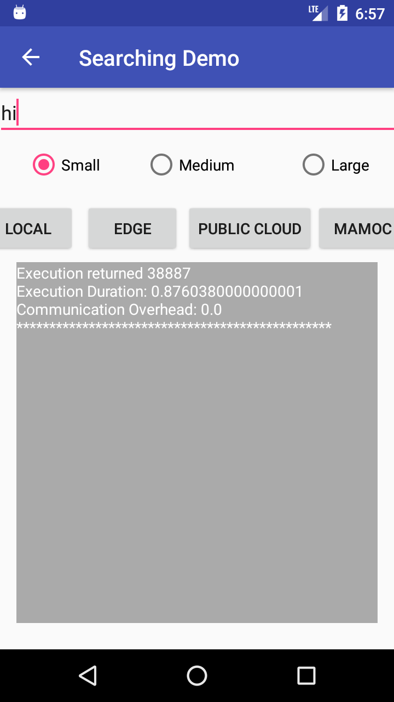
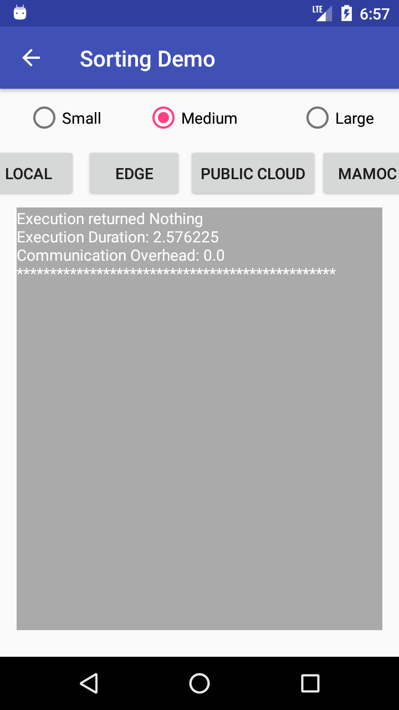
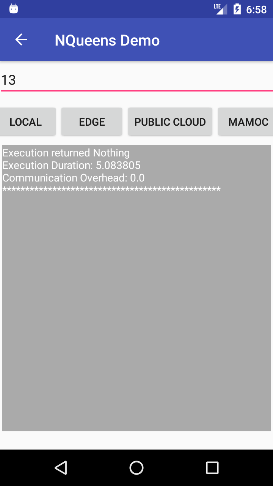

# MAMoC-Android-Demo-Apps
This demo uses the [MAMoC Android Offloading Framework](https://github.com/dawand/MAMoC-Android). If you want to setup the server components, please visit [MAMoC-Server](https://github.com/dawand/MAMoC-Server) repository.

## Installing and Testing the Demo Apps

### Description of the Demo Apps
The demo applications show three representative use case offloading tasks:

<p align="center">


 
</p>

### Text Search
This allows a user to enter a keyword and select a file size from (small, medium, and large) to find the occurrences of the keyword in the selected file. [Knuth-Morris-Pratt](https://www.nayuki.io/page/knuth-morris-pratt-string-matching) string searching algorithm is used. 

The offloadable class: [KMP.java](app/src/main/java/uk/ac/standrews/cs/mamoc_demo/SearchText/KMP.java)
The activity class: [SearchActivity.java](app/src/main/java/uk/ac/standrews/cs/mamoc_demo/SearchText/SearchActivity.java)

### Quick Sort
QuickSort is a Divide and Conquer algorithm. It picks an element as pivot and partitions the given array around the picked pivot.

The offloadable class: [Quicksort.java](app/src/main/java/uk/ac/standrews/cs/mamoc_demo/Sorting/QuickSort.java)
The activity class: [SortingActivity.java](app/src/main/java/uk/ac/standrews/cs/mamoc_demo/Sorting/SortingActivity.java)

### NQueens
The eight queens puzzle is the problem of placing eight chess queens on an 8×8 chessboard so that no two queens threaten each other.

The offloadable class: [Queens.java](app/src/main/java/uk/ac/standrews/cs/mamoc_demo/NQueens/Queens.java)
The activity class: [NQueensActivity.java](app/src/main/java/uk/ac/standrews/cs/mamoc_demo//NQueens/NQueensActivity.java)

## Developing Android Applications with MAMoC Offloading Support
Let's start with a simple Android/Java class `PrimeCounter.java` that counts the number of prime numbers between one and a given number `n`:

```java
public class PrimeCounter {
    long n;

    public PrimeCounter(long n){
        this.n = n;
    }

    public long run() {
        int count = 0;
        for(int number = 2; number < n; number++){
            if(isPrime(number)){
                count++;
            }
        }
        return count;
    }

    private boolean isPrime(int number){
        for(int i=2; i<(number/2); i++){
            if(number%i == 0){
                return false; //number is divisible so it is not prime
            }
        }
        return true; //number is prime now
    }
}
```

Design assumptions for the offloadable classes:
1. The class contains a constructor that receives the required parameters from the caller classes.
2. The class contains a `run` method of either a return or a non-return type.
3. The `run` method does not depend on any native features of the mobile device and does not call any Android system library methods.

In order to make the above class compatible with MAMoC offloading library, you need to follow the steps below:
* Include the [MAMoC client](https://bintray.com/dawand/mamoc_client) in the *build.gradle* file of your Android module:
  ```gradle
  dependencies {
        implementation 'uk.ac.standrews.cs:mamoc_client:0.14'
  }
  ```
* Next, perform the following steps:
  * Add the @offloadable annotation to the class. If the class needs input files, set `resourceDependent` option to `true`. If the task can be independently parallelized into subtasks set `parallelizable` option to `true`.
    ```java
    import uk.ac.standrews.cs.mamoc_client.Annotation.Offloadable;

    @Offloadable(resourceDependent = false, parallelizable = false)
    public class PrimeCounter {
        ...
    ``` 
  * You can now create an `Activity` to contain the calling method of the offloadable class.
  * You need to include the following code in your `onCreate` method of the Activity to get an instance of the framework and initialize its components:
    ```java
    mamocFramework = MamocFramework.getInstance(this);
    mamocFramework.start();
    ```
  * Before executing the task, you need to register the local broadcast object to receive the results and duration of the execution
    ```java
    LocalBroadcastManager.getInstance(this).registerReceiver(mMessageReceiver, new IntentFilter(OFFLOADING_RESULT_SUB));
    ```
  * Also include this method to receive broadcasts from the framework:
    ```java
    protected BroadcastReceiver mMessageReceiver = new BroadcastReceiver() {
        @Override
        public void onReceive(Context context, Intent intent) {

            String result = intent.getStringExtra("result");
            Double duration = intent.getDoubleExtra("duration", 0.0);
            Double overhead = intent.getDoubleExtra("overhead", 0.0);

            addLog(result, duration, overhead);
        }
    };
    ```
  * You can then customize addLog to your needs (Log it or print it to a textview):
    ```java
    protected void addLog(String result, double executationDuration, double commOverhead) {
        Log.d("Execution returned ", result);
        Log.d("Execution Duration: ", executationDuration);
        Log.d("Communication Overhead: ", commOverhead);
    }
    ```
  * Finally, you can call the offloadable class to be executed by MAMoC (`LOCAL`: Locally, `NEARBY`: on a nearby mobile device, `EDGE`: on an edge node, `PUBLIC_CLOUD`: on a public cloud instance, or `DYNAMIC`: let MAMoC decide for you):
    ```java
    String taskName = PrimeCounter.class.getName();
    long n = 100000;
    mamocFramework.execute(ExecutionLocation.DYNAMIC, taskName, n);
    ```
* You can create more sophisicated activites with all the offloading scenario options. Have a look at [`SearchActivity.java`](app/src/main/java/uk/ac/standrews/cs/mamoc_demo/SearchText/SearchActivity.java) in this repo. Note that we have added a superclass [`DemoBaseActivity.java`](app/src/main/java/uk/ac/standrews/cs/mamoc_demo/DemoBaseActivity.java) to include the common methods used by the activities of all the three demo apps.

## Understanding Execution Location in MAMoC framework

1. LOCAL

2. NEARBY

3. EDGE

4. PUBLIC_CLOUD

5. DYNAMIC

TBD